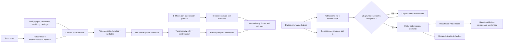

# The Backyard — AI-First Phase 1

## Estado y guardrails

La rama `ai-first-phase1` nació del checkpoint limpio de `beta`:

`98c700028c1d1481e64d164d5691e322eb445996`

Todo lo nuevo vive en esta rama. Esta entrega no autoriza ni realiza merge a `beta` o `main`, cambios en `app.thebackyard.com.mx`, despliegues a Production ni DDL sobre un Supabase compartido con producción. `beta` permanece como punto de recuperación.

Phase 1 reutiliza la aplicación, modelos y motores existentes. Los módulos nuevos se concentran en `lib/backyard-ai/`, `app/components/backyard-ai/` y `app/api/backyard-ai/`; no se reconstruyeron score, apuestas, handicap, histórico, grupos, rounds, Rules AI, GPS, campos, My Bag, Ball Fit, Polla Live, voz, fotos ni sincronización.

## Arquitectura que se debe preservar

Backyard AI interpreta. El dominio valida. El motor existente calcula.

No existe un camino `usuario → LLM → dinero`. Los endpoints AI no importan el motor, no eligen ganadores y no producen balances, netos o liquidaciones.

## Implementado en la rama

### 1. Backyard AI Round Setup

- Home y Jugar muestran **✨ CONFIGURAR CON BACKYARD AI** como entrada principal.
- La configuración manual permanece disponible como fallback y edición avanzada.
- La misma composición acepta texto o el dictado ya existente. El navegador convierte audio a texto; estos endpoints no reciben audio.
- El parser determinista `es-MX` reconoce lenguaje coloquial, montos mexicanos, roster, HCP, campo/tee, salida 1/10, 9/18 hoyos, ventajas sobre campo/entre jugadores, participantes, exclusiones, parejas, carry y configuraciones compatibles con el catálogo real.
- El proveedor remoto es opcional. Sólo normaliza la instrucción a `canonicalCommand`, `confidence` y una aclaración bajo JSON Schema estricto. Un guard canónico descarta cambios detectables en los hechos explícitos que el parser local puede representar, incluidos cifras, roster, exclusiones, equipos y modalidades.
- Ante indisponibilidad o rechazo del proveedor, continúa el parser local. La edición manual nunca queda bloqueada.
- Una autorización de proveedor sirve para una sola instrucción y se revoca si cambia el texto, dictado o sugerencia.

El parser llena los modelos reales para las modalidades representables: Skins, Conejos, Unidades/Copas, Foursome, Mini Polla, Viboritas, Camellos, Peces, Loba, Monkey, Bola Amiga, Polla/Nassau grupal, Nassau individual, Dollar a Stroke, Presiones individuales, Presiones por parejas, Chicago, Vegas y Mínimo de Putts. Las variantes o ajustes no representables se preguntan o pasan a edición manual; no se crean modalidades ficticias. Algunos multiplicadores y configuraciones avanzadas —por ejemplo, presiones internas de Foursome/Personales o multiplicadores específicos de segunda vuelta— sólo se heredan de un template/histórico compatible o se editan manualmente en Phase 1.

### 2. Context resolver y cambios incrementales

Antes de preguntar, el resolver consulta en el dispositivo:

- perfil y HCP;
- jugadores y grupos frecuentes;
- templates reales de grupo;
- draft activo y rondas anteriores;
- campo/tee frecuente y catálogo disponible;
- preferencias privadas habilitadas por el usuario.

Resuelve referencias como “los mismos del domingo”, “los mismos de siempre”, “como la semana pasada”, un grupo por nombre y la última ronda en un campo. Si el usuario da nombre y HCP de un jugador nuevo en la misma frase, puede crear el candidato temporal sin volver a pedir el mismo dato. Si hay homónimos, varios tees o una variante real ambigua, pregunta sólo esa variable.

Los cambios conversacionales son parches. Por ejemplo, “Mejor skins de 300” modifica el valor de Skins sobre el draft activo y conserva campo, jugadores, HCP, equipos y las demás apuestas.

### 3. `RoundSetupDraft` y pantalla TU RONDA

`RoundSetupDraft` adapta y clona `Player`, `Course`, `BetConfig`, apuestas personales, suplementarias, manuales y segmentos existentes; no es un segundo dominio de ronda. Antes de iniciar valida campo/tee real, roster, jugador principal, participantes y `collectBetConfigurationIssues`.

La revisión muestra campo, tee, fecha, salida, duración, jugadores, handicaps, ventajas, equipos, apuestas, montos y configuraciones especiales. Permite **INICIAR RONDA**, **CAMBIAR ALGO** o abrir la edición manual avanzada sobre los mismos datos.

### 4. Backyard Card AI

- Permite cámara o selección de una a cuatro fotos JPEG, PNG o WebP.
- Reutiliza `lib/scorecard-photo.ts` e IndexedDB; las copias se guardan localmente y quedan ligadas al propietario.
- Cada observación normalizada conserva `value`, `confidence` y `source.photoId`. Los tipos internos están preparados para región y fragmento OCR breve, pero el JSON Schema del proveedor actual no los solicita todavía.
- Extrae evidencia de campo, jugadores, hoyos, par, OUT, IN y TOTAL. No completa scores ausentes.
- El validador cruza ronda activa, campo, jugadores esperados, salida, 9/18 hoyos, par, scores digitales, rangos, subtotales y total.
- Si 70 de 72 celdas son confiables y no existen otras inconsistencias de jugador, campo, foto o totales, sólo las dos dudosas son editables. Cuando no quedan dudas, muestra la tabla completa de scores extraídos para una confirmación explícita antes de tocar la ronda.
- Un conflicto entre fotos, un score digital diferente, un campo dudoso, un total incoherente o un valor fuera de rango nunca se resuelve silenciosamente.
- La autorización de fotos también es de un solo uso y se revoca al agregar, quitar o escanear.

Las capturas especiales de modalidades como Viboritas, Camellos, Peces, Loba, Unidades o Bola Amiga permanecen en los controles existentes. Una foto de scores no inventa esos eventos. Si faltan, la app guarda los scores y regresa a la ronda para completarlos antes del resultado.

### 5. Cierre, resultado y recap

Los scores confirmados alimentan el flujo actual. `lib/engine.ts`, `lib/side-bets.ts` y `lib/supplemental-bets.ts` siguen siendo las únicas fuentes de cálculo. `settleBalances` produce la liquidación mínima existente.

La pantalla **RONDA TERMINADA** presenta score, bruto/neto cuando corresponde, resultado por modalidad, balance total por jugador y liquidación. El flujo intenta guardar en Histórico de forma asíncrona y sólo lo declara guardado tras confirmar la persistencia. También aclara que The Backyard registra acuerdos privados: no recibe, custodia o procesa fondos y no actúa como sportsbook o casa de apuestas.

El recap de Phase 1 es deliberadamente determinista. Sólo redacta hechos presentes en balances, transferencias y contadores ya calculados; no llama a otro LLM ni inventa narrativa.

## Backyard Golf Brain

### A. Personal Memory

Existen contratos y almacenamiento owner-scoped para `UserPreference`, `GroupPreference`, `AIInteraction`, `AIAction`, `AICorrection`, `LearningEvent` y `ScorecardCorrection`. La memoria personal, el aprendizaje global y la retención de inputs comienzan en **OFF**.

Los eventos aceptados y correcciones sólo se guardan cuando `personalMemoryEnabled` está habilitado. Hoy la preferencia productiva aprendida directamente desde conversación es una exclusión confirmada expresada como “nunca juega”; el resto de hábitos se recupera principalmente de histórico y templates. La persistencia es local y no sincroniza entre dispositivos.

Una corrección de tarjeta registra un identificador opaco de jugador, valor propuesto, confianza, valor confirmado y evidencia de origen. No inicia entrenamiento.

### B. Global Knowledge

`KnowledgeSource` y `KnowledgeItem` modelan tipo de fuente, nombre/identificador, URL o referencia, fechas, confianza, jurisdicción, versión, locale, región, `ruleset`, vigencia, alcance y derechos de uso. Distinguen `OFFICIAL`, `VERIFIED`, `COMMUNITY`, `USER_PROVIDED` e `INFERRED` sin fusionar procedencias.

La recuperación filtra por ámbito, acceso, región, ruleset, vigencia y confianza. Un item global no puede contener IDs de propietario o grupo. En Phase 1 esto es una base de tipos, validación y recuperación en memoria: no existe repositorio global curado, panel editorial ni pipeline de verificación humana.

### C. Learning Dataset

Todo evento nace `PERSONAL` y `trainingUse: EXCLUDED`. La transformación desidentificada exige propietario coincidente, consentimiento global habilitado con fecha de otorgamiento y sin revocación, evento verificado y una allow-list que rechaza claves o strings no permitidos. Un futuro caller debe aportar identificadores para redactar y someter el resultado a revisión antes de exportarlo. La función no comprueba por sí sola que una `policyVersion` arbitraria sea la vigente; el caller debe suministrar el consentimiento leído con la política actual.

El resultado posible queda `ELIGIBLE`, no entrenado ni exportado. No hay UI de consentimiento global, uploader, dataset productivo, auto-training o fine-tuning.

## Catálogo de campos y México-first

Se reutilizan `lib/golf-course-directory.ts`, `lib/course-catalog.ts` y `lib/golf-providers.ts`: club, layout/campo, tee, hoyo, yardage y geometría son independientes del proveedor. El modelo core conserva país, estado, ciudad, coordenadas, timezone, par, stroke index, yardage, rating, slope, fuente, ID externo y fecha de verificación cuando existen. La confianza vive por ahora en `KnowledgeSource`/`KnowledgeProvenance`; no existen todavía entidades o tablas durables `CourseSource`/`CourseVerification` ni un pipeline productivo que conecte el adapter de procedencia.

`createProvenancedCourseAdapter` sólo admite importación remota cuando la fuente declara derechos compatibles y la capacidad correspondiente. `UNKNOWN` no equivale a permiso. No hay scraping de GHIN/USGA.

La rama no agrega todavía una fuente licenciada, miles de campos mexicanos, import jobs ni verificación continua. Tampoco crea un nuevo growth loop: reutiliza grupos, histórico, leaderboard y el compartir/copiar existente —incluido WhatsApp—; invitaciones, deep links, QR, rivalidades y un loop de crecimiento medible requieren una fase posterior de producto e infraestructura.

## Privacidad, consentimiento y seguridad

- El Aviso de Privacidad `2026-09-08-v3` ya describe Round Setup AI, Card AI, memoria privada opt-in, OpenAI, Supabase y la geolocalización opcional “Cerca de mí”. Su cambio fuerza nueva aceptación, pero requiere revisión jurídica mexicana antes de lanzamiento.
- Cada llamada remota exige consentimiento afirmativo y versionado por solicitud: `{ granted: true, version }`. Esta prueba protege el boundary de la solicitud, pero no se persiste server-side como evidencia auditable de cuenta.
- `OPENAI_API_KEY` y las claves Supabase privilegiadas son server-only. Ninguna usa `NEXT_PUBLIC_`.
- Las respuestas son `private, no-store`; el adapter usa salida estricta, `store: false`, timeout y límites de tamaño. Esto no sustituye la revisión contractual de retención, residencia, subprocessors y uso de datos de OpenAI.
- Setup: 2,400 caracteres, 16 KB, 20 solicitudes/minuto por IP/origen y 100/minuto global.
- Card AI: 1–4 fotos, 18 MB totales, 6 requests/minuto por IP/origen, 12 fotos/minuto por IP/origen y 100 fotos/minuto global.
- Los límites combinan un mapa local acotado con el RPC atómico y persistente `consume_rules_ai_rate_limit`; las llaves usan HMAC y no guardan la IP en claro.
- Los endpoints aún no tienen autenticación ni cuotas por cuenta/dispositivo/día. El limiter depende de IP/global y su tabla requiere política explícita de TTL/retención/cleanup.
- Los flujos de lectura y selección de IDs para borrado de fotos son owner-scoped; el primitivo final borra los IDs ya seleccionados. La vinculación guest→cuenta adopta sólo blobs referenciados antes del ciclo cloud y puede reintentarse idempotentemente.
- El borrado server-side recorre Storage, el grafo fijo de tablas/referencias y Auth en ese orden. En el dispositivo actual coloca primero un marker local que bloquea los flujos instrumentados de autosave/offline/cloud, cubre referencias activas, archivadas, offline, learning e índice de propietario, y ofrece reintento si la respuesta quedó pendiente. El cleanup local sigue siendo best-effort; una prueba real de RLS/Storage con dos cuentas y carreras entre dispositivos permanece pendiente.
- No existe entrenamiento ni exportación automática.

## Configuración externa

La interpretación local y el modo manual no requieren proveedor. Las llamadas remotas sólo están listas cuando se cumplen todos estos requisitos:

| Variable/recurso | Requisito |
| --- | --- |
| `BACKYARD_AI_ENABLED=true` | Activación explícita; si se omite, los endpoints quedan apagados. |
| `OPENAI_API_KEY` | Clave server-only para setup y visión. |
| `NEXT_PUBLIC_SUPABASE_URL` | URL del proyecto Beta usado por el limiter. |
| `SUPABASE_SECRET_KEY` o `SUPABASE_SERVICE_ROLE_KEY` | Credencial server-only del limiter. |
| `CLOUD_ENABLED` | No debe estar explícitamente apagado. |
| `consume_rules_ai_rate_limit` | Debe estar aplicado desde `supabase/migrations/20260904104145_rules_ai_rate_limit.sql` y validado en Beta aislada. |
| `OPENAI_BACKYARD_MODEL` | Override opcional; default `gpt-5.4-mini`. |
| `OPENAI_SCORECARD_MODEL` | Override visual opcional; hereda el modelo general. |

También se necesita autorización del navegador para dictado/cámara y una revisión contractual/legal de los proveedores. Ninguna variable de Production debe cambiar para validar esta rama.

## Matriz de alcance real

| Área | Estado de Phase 1 | Pendiente externo o posterior |
| --- | --- | --- |
| Setup texto local, contexto, draft, revisión y cambios parciales | Implementado y cubierto por tests/QA local | Corpus real mexicano y calibración de preguntas. |
| Setup remoto | Boundary implementado, fail-closed | OpenAI + limiter Supabase Beta y QA real. |
| Dictado | Integrado con infraestructura existente | QA físico por navegador/dispositivo y permisos. |
| Card AI 1–4 fotos | UI, storage, contrato, normalización y validación implementados | Proveedor real, tarjetas físicas variadas y calibración OCR/confidence. |
| Foto → scores → engine | Integrado | E2E físico; capturas especiales siguen manuales. |
| Resultado/settlement/recap | Implementado sobre motor existente | QA de ronda física de todas las variantes. |
| Memoria personal | Local, opt-in y owner-scoped | Sync multi-device, UI de inspección/borrado granular. |
| Global Knowledge | Contratos, procedencia y retrieval | Repositorio curado y workflow editorial. |
| Learning Dataset | Eventos y transformación desidentificada | Consent UI global, ingesta, revisión, exportación y revocación. |
| Métricas | Agregados locales sin contenido sensible; duración por envío/plan y foto→resultado sólo dentro de la sesión activa | Telemetría central, tiempo total hasta confirmar y denominadores de producto. |
| Rate limiting | Local + Supabase persistente atómico | Auth, cuotas diarias, TTL, WAF y presupuesto. |
| Campos México | Modelo/provider-neutral y seed existente | Fuente licenciada, import masivo, deduplicación y verificación. |
| Grupos/growth | Grupos, histórico, leaderboard y compartir/copiar (incluido WhatsApp) reutilizados | Invitaciones, deep links, QR, rivalidades y loop medible. |

## Evidencia de cierre

Los resultados finales deben corresponder al último árbol de la rama, no a una ejecución anterior.

| Comprobación | Estado | Evidencia |
| --- | --- | --- |
| Suite completa | `PASS` | `npm test` equivalente (`pnpm dlx npm@11.6.0 test`), exit 0: 1,185/1,185 tests. |
| Lint | `PASS` | `npm run lint` equivalente (`pnpm dlx npm@11.6.0 run lint`), exit 0, sin errores ni warnings. |
| Build Next.js | `PASS` | `npm run build` equivalente (`pnpm dlx npm@11.6.0 run build`), exit 0; Next.js 16.3.3/Turbopack, TypeScript y 20/20 páginas estáticas. |
| Setup local | `PASS_LOCAL_QA` | 8-sep-2026, Codex in-app browser en `localhost:3000`. Prompt: “Hoy jugamos Said HCP 10, Pedro HCP 12, Juan HCP 18 y Carlos HCP 20 en La Vista, salimos por el 1, 18 hoyos. Skins de $200, Nassau de $500 y Bola Amiga Said/Juan contra Pedro/Carlos. Ventajas entre jugadores.” Observado: roster/HCP/campo/salida/duración/apuestas correctos y sólo “¿Con qué tee de La Vista juegan?”; se eligió Blancas. “Mejor skins de 300” conservó Polla en 500 e inició ronda. |
| Card entry + manual fallback | `PASS_LOCAL_QA` | QA de UI/DOM: selector/cámara, límite 0–4, consentimiento y CTA visibles; regreso a captura manual verificado. No equivale a prueba de cámara física ni extracción real. |
| Setup con proveedor real | `PENDING_EXTERNAL_QA` | Requiere configuración anterior. |
| Dictado en dispositivo | `PENDING_DEVICE_QA` | No sustituido por tests. |
| Tarjetas físicas 9/18 y 1–4 fotos | `PENDING_EXTERNAL_QA` | No sustituido por fixtures. |
| Scores → capturas especiales → resultado → histórico | `PENDING_E2E_QA` | Falta ronda física integral. |
| Sync, RLS, Storage y delete con dos cuentas/dispositivos | `PENDING_INFRASTRUCTURE_QA` | Requiere Supabase Beta aislado. |
| Preview Vercel | `POST_COMMIT_EVIDENCE` | La URL inmutable y el smoke test se registran en el reporte de entrega, porque se generan después de congelar el commit. |
| Commit/push | `POST_COMMIT_EVIDENCE` | El SHA remoto de `ai-first-phase1` y la comprobación de no-merge se registran en el reporte de entrega. |

## Riesgos y deuda técnica

1. La calidad del proveedor no se puede inferir de tests estructurales; necesita un corpus de frases y scorecards físicos con gold labels.
2. El parser local es amplio pero deliberadamente conservador y sólo está optimizado para `es-MX`; variantes regionales ambiguas van a pregunta/manual.
3. Fotos nítidas aún pueden fallar por formato, letra, sombras o varias tarjetas; no hay recorte progresivo, reintento por celda ni OCR especializado.
4. Las capturas especiales impiden que toda ronda sea literalmente “foto → resultado” hasta que sus eventos se capturen o una fase futura los extraiga con evidencia propia.
5. Memoria y métricas sólo viven en este dispositivo. Global Knowledge y Learning Dataset son arquitectura, no servicios operativos.
6. El límite distribuido ya existe, pero falta identidad, cuotas por cuenta/día, TTL, WAF, presupuesto y validación multi-instancia.
7. El consentimiento de proveedor es transaccional, no una constancia server-side atribuible. Faltan controles de consentimiento global y borrado granular de memoria.
8. El borrado está endurecido en el dispositivo actual, pero no tiene una validación de carrera cross-device/Storage/RLS con dos cuentas reales.
9. El Aviso v3, tratamiento financiero/patrimonial, transferencias y términos de proveedor requieren revisión jurídica antes de cualquier lanzamiento.
10. No hay fuente licenciada ni pipeline operativo para miles de campos mexicanos.

## Recomendación concreta para Phase 2

Priorizar **confiabilidad medible y memoria segura**:

1. Crear un entorno Beta aislado para Auth, Storage y Postgres; validar RLS, borrado y carreras con dos cuentas/dispositivos.
2. Endurecer el limiter local+persistent con identidad, cuotas diarias, TTL, WAF, presupuesto y telemetría sin inputs.
3. Construir un corpus mexicano consentido y desidentificado de instrucciones y tarjetas físicas, con gold labels y métricas por campo/celda.
4. Sincronizar memoria privada sólo después de definir tablas owner/group-scoped, retención, auditoría, revocación y borrado granular.
5. Crear workflow editorial para fuentes, variantes regionales/ruleset y un proveedor licenciado de campos mexicanos.
6. Calibrar umbrales para maximizar rondas con cero/una pregunta y minimizar correcciones; sólo después evaluar modelos especializados o fine-tuning.
