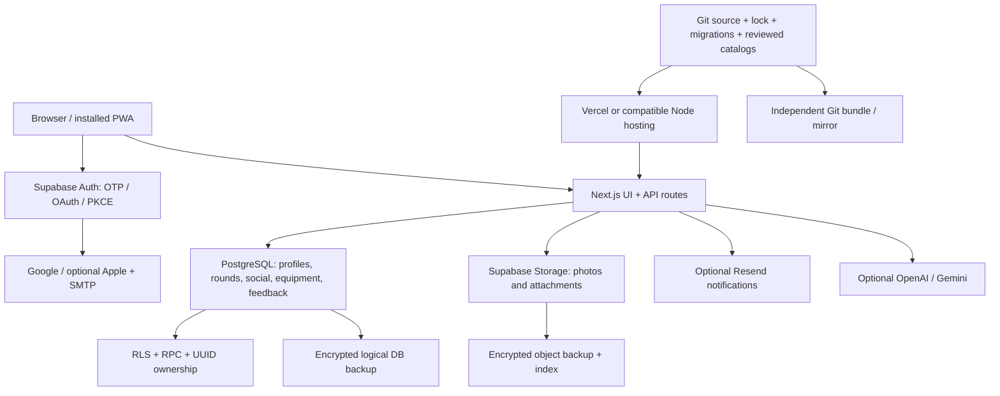

# Architecture

The Backyard is a Next.js/React golf application with deterministic local domain logic and a Supabase-backed cloud layer. It is not generated dynamically by Codex. A competent developer can build its source without any AI tool account.

## Frontend and backend

App Router pages, shared components and lib modules render the UI. Next API routes verify identity and call database RPCs/provider APIs. `lib/supabase/client.ts` maintains one browser client with PKCE and session persistence; server credentials remain in `lib/supabase/server.ts` and server routes.

Scores, HCP calculations, bets and settlements use deterministic domain logic. AI interpretation never replaces final money calculations. Offline/local-first round edits require later sync; a server backup cannot recover changes which never reached the server. Preserve the original browser profile/device during incidents.

## Data relationships

auth.users UUID → private/account profile → golf profile, equipment and user settings. Rounds contain canonical owner/participant references, scores and frozen configuration/course/equipment snapshots. Social links and confirmed shared history must retain those UUIDs. Recreating users with fresh UUIDs destroys linkage; restore identity/data coherently rather than joining by email.

The public schema includes RLS-protected application tables; private and managed schemas also have dependencies. Equipment/catalog files in data are packaged into the application and imports can populate SQL; restore both source and DB. Feedback stores requests independently of secondary notification delivery.

## Deployment and provider boundaries

Git contains source/configuration, not deployment secrets. Vercel builds Next; it is replaceable by a full Node/Next server. Supabase is more than PostgreSQL: Auth, PostgREST/RPC semantics, Storage and Realtime need equivalents or the self-hosted stack. A plain PostgreSQL hostname substitution is not a working migration.

Public profile identifiers are stable independently of username. Canonical origin/domain preparation does not authorize DNS cutover. OAuth redirect origins, cookie/PKCE state, CORS and storage signed URLs must be reviewed for a new hostname.

Optional provider failure should disable that capability, not prevent manual golf/round use. Preserve existing feature-flag fail-closed behavior; do not enable Polla, GHIN, push, payments or unlicensed integrations during recovery.
