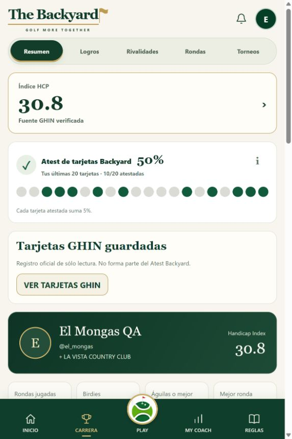
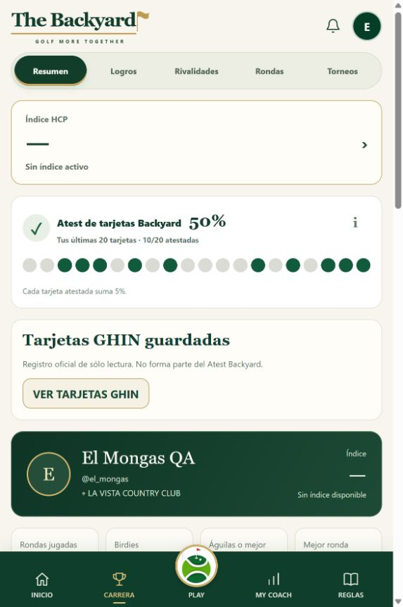
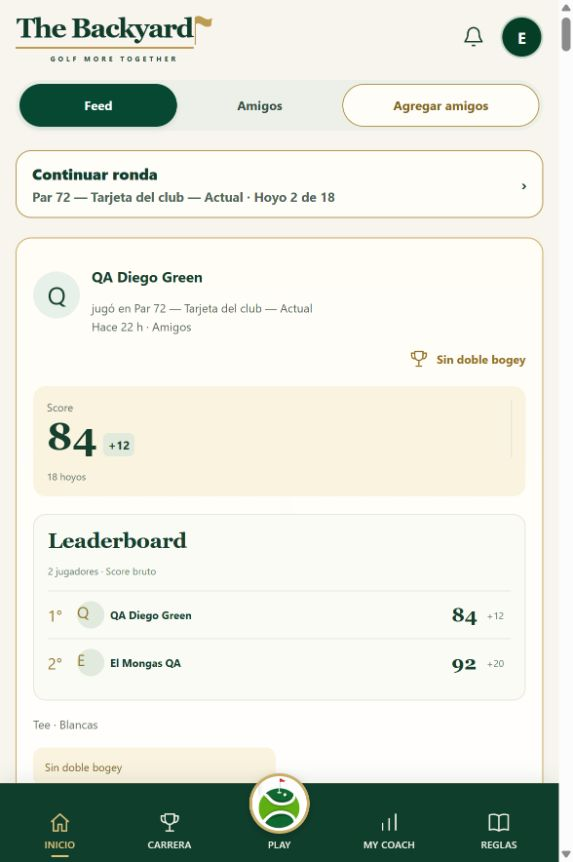

# GHIN source transition — el_mongas — DEV

**STATUS: USER_REAUTH_REQUIRED.** Implementation, local regression checks and
real unlink passed. Independent private-session verification and manual relink
remain required; this report does not declare DONE.

## A. INDEX_STATE_MODEL

Before this change, the account resolver already prioritized VERIFIED GHIN,
but Carrera separately recalculated the historical Backyard 5.5 and displayed
it as a preserved alternative. No reset boundary prevented its future revival.
The value was derived from historical eligible Backyard rounds, not a separate
stored numeric Index. The old Auth preference selected GHIN and disabled Backyard.

The server now owns `player_handicap_source_state`: reset instant, transition
instant and revision, retained player identity and at most 20 retained score IDs.
The current source is GHIN only when VERIFIED. Without that link and after
reset, no old preference or historical cards activate an Index automatically.

## B. BACKYARD_INDEX_RESET_IMPLEMENTATION

PASS. A confirmed VERIFIED profile transition records the reset atomically.
Same-identity VERIFIED refresh/reauth and initialization are idempotent. The
server-owned revision overrides stale browser preferences, including a clock
set far in the future. Unlink advances source revision without moving reset.

The existing linked account adopted its boundary once at
`2026-10-07T01:48:57.501033Z`. Future explicit Backyard activation can use only
eligible rounds started strictly after that boundary. GHIN-only cards remain
excluded. Old rounds, scores and frozen playing handicaps are unchanged.

Migration `20261007012847_ghin_index_epoch_retained_history.sql` was applied only
to DEV project `bymeopxkxapfizeeqeyb`, branch `phase2-full-platform-qa`. Owner
SELECT requires authenticated identity, active account and nonanonymous session.
Authenticated/anon cannot write the state or execute transition RPCs. Server
writes retain fixed search paths and existing ownership rules. Security advisors
show exactly the same four preexisting notice groups, no new findings.

Rollback policy: retain state and historical evidence; disable transition UI
if required. Never restore old preferences or drop/delete historical data.

## C. LINKED_STATE

PASS in real DEV. Profile and Carrera showed GHIN 30.8 as the sole active Index,
without “Backyard Index conservado 5.5”. Local integration verifies new-round
GHIN selection and frozen Course Handicap. No new real round was created.

## D. UNLINK_PRECHECK

PASS. Provider scores and posting receipts reference the owner and canonical
round, not the active provider profile. Round references use DELETE RESTRICT.
Deleting the active profile cannot cascade into provider history or receipts.
The replacement unlink RPC locks that profile, selects latest 20 by played date
and stable provider ID, records retained IDs and deletes only the active link.
No provider score, posting receipt or round DELETE occurs in this transition.

## E. UNLINK_RESULT

PASS, executed once through the normal DEV UI. Server link is absent.
Unlinked at `2026-10-07T01:58:14.627314Z`, source revision2. Modal explained
retention and absence of an active Index before execution.

## F. RETAINED_GHIN_CARDS

PASS, all seven persisted cards retained (fewer than20):
`1208915748`, `902029046`, `899647834`, `888298526`, `853907291`, `819244193`,
`816066271`. Normal owned GET reads them without a live provider session.
Server database and Profile both confirm seven, one linked, zero ambiguous.
With >20, older rows remain archived; historical linked-round provenance remains
visible even outside the retained GHIN-only window. Local Postgres tests cover
0,7,25 cards and exactly20 retained without destructive deletion.

## G. BACKYARD_INDEX_AFTER_UNLINK

PASS. Active source NONE, active value NONE. Carrera displays **Sin índice
activo**. Old5.5 does not return. The canonical boundary persists independently
of the deleted active link and stale Auth/browser metadata.

## H. HISTORY_AFTER_UNLINK

PASS. All27 original snapshot hashes, lifecycle states and versions match the
prechange snapshot:23completed,1cancelled,3live. Carrera → Rondas retains the
six GHIN-only cards,22 Backyard-only completed and one QA25 Backyard+GHIN row.
No import or new round was used to achieve retention.

## I. QA25_RECEIPT_AFTER_UNLINK

PASS. Original round `49cd75db-eb6f-47fa-9e0e-b1841ae0f93b`, provider score
`1208915748`, receipt `106216c7-cdbb-4e30-824c-ebf35139c039` and fingerprint
`5a940101e675cdc613b76e11764e57fdde0ac7788484283f8e69f24464ae413c` unchanged.
Receipt remains SUCCEEDED; QA25 gross103 and frozen GHIN30.8/CH36 remain intact.
No provider posting was performed in this task.

## J. QA24

PASS. Active draft `rrouggse`, round `16e2c462-e6c3-4d5d-80d4-b68f6fc25a2d`,
version5, H1 owner5/guest6, H2 pending. Active-draft hash and version494
unchanged. Inicio still offers **Continuar ronda · Hoyo2 de18**. No score edit,
resume, cancel or completion was performed.

## K. CLEAN_SESSION_UNLINKED

USER_REAUTH_REQUIRED. The original agent session was closed through UI. The
owner has been asked to open a NEW Safari private window, log in manually and
verify the unlinked state, seven retained cards, QA25 once, QA24 H2 and Carrera.
An IAB tab shares browser storage and is not claimed as a clean-context proof.
Relink will follow only after this independent verification.

## L. RELINK

USER_REAUTH_REQUIRED; not yet executed. The owner must authenticate the SAME
GHIN manually in DEV. No passwords or OTPs are collected in chat or code.
Local Postgres already verifies relink creates one new source epoch, retains
provider IDs/receipts and does not move the boundary on subsequent refresh.

## M. REIMPORT

Not executed after real relink. Result `IMPORTED_NEW` is unknown, not zero.
Local integration executes the canonical import RPC after unlink/relink and
verifies zero new rows for retained provider IDs.

## N. QA25_IDEMPOTENCE_AFTER_RELINK

Real preflight pending relink. Local owned-service regression returns
ALREADY_POSTED from the existing canonical receipt before resolving a provider
session or making upstream POST. Real provider POST count in this task:0.

## O. CAREER

PASS in linked and unlinked DEV.23completed, average83.7, best71, birdies18,
and historical rich Backyard data remain. Provider adjusted-only cards do not
invent gross, birdies, putts/GIR, rivalry or betting evidence. One QA25 row;
five approved real subviews, no hero/anchor architecture changes.

## P. ATEST

PASS, unchanged **10/20=50%**. Before QA25 the prior window was11/20=55%; QA25
pending had legitimately displaced one atested card before this task. The eleven
historical attestations were not deleted. Link/unlink does not change Atest.

## Q. REQUEST_BUDGET

Observed browser diagnostics so far: cloud sync GET2, POST0, cloud rounds0,
retry0, failure0. Two full535,006-byte bundles are explained by initial login
and one deliberate reload to adopt the deployment, both mount/knownCloud=false.
Unexpected full bundles0. No upload followed either hydration. GHIN persisted
import GET3, largest4,551bytes; import POST0; unlink1; relink0; provider POST0.

Profile requests are not fully byte-instrumented; their total is unknown.
Runtime-log absence is not substituted for request counts. Final authenticated
two-minute idle verification is pending. No polling, storm or abnormal retry
was observed during the finite explicit navigation/unlink flow.

## R. TESTS

Directed81/81PASS. Full suite4,705tests:4,696PASS,9exact preexisting failures,
zero new failures. TypecheckPASS, lintPASS, buildPASS. New tests exercise real
local Postgres triggers, transactions, RLS, retention, relink/import, source
selection, stale clocks, future epochs, frozen snapshots and owned route reads.

Preexisting failures, unchanged from the before-code unsandboxed baseline:

- provider diagnostics contain no token, resource URL or personal coordinates
- new renderer is under demand with local position updates, cleanup and real terrain exaggeration
- round opens isolated GPS view without changing score navigation or creating another round
- every module flag is independent and opt-in, GPS doesn't require map or flyover
- la UI final usa bolsa premium, selección guiada y modo manual explícito
- Mi bolsa abre una ficha limpia por bastón y reserva el borrado para el detalle
- Mi Bolsa keeps approved product media while permanent management stays compact
- Reglas dejan IA/directorio plegables, recursos como accesos directos y videos abiertos al final
- nightly audit artifacts reproduce from canonical runtime catalogs and captured QA metadata

## S. GIT

InitialSHA `5c72b134a85a16b70c272cdc12782f7a0470617a`, clean integration branch.
Concurrent GPS commit `9016d5cd0de488be64d619f8f67a489f5d4f7307` preserved.
Core `de7eb6ce0fca4a9f684d5742d2564e720ee67afd` and tests
`f369b73ee373b5b12684d271ec68b4750f30df63` pushed only to integration.
Docs/evidence commit will contain this checkpoint. Main, beta, Production,
productive domain and other accounts were not modified.

## T. DEPLOYMENT

https://dev.thebackyard.com.mx/api/health HTTP200, environment preview,
buildSHA `f369b73ee373b5b12684d271ec68b4750f30df63`, deployment
`dpl_AYE79G5Wfpxcq1b7ACjCa72XumfS` READY. No Production deployment.

## U. MANUAL_REVIEW

[Manual guide](../MANUAL_REVIEW_EL_MONGAS_GHIN.md) updated to the current source
rule. Prior QA25 posting/round-trip evidence is preserved as historical proof.
[Transition manifest](GHIN_INDEX_TRANSITION_EL_MONGAS.json) includes exact IDs
and checkpoint hashes without passwords, auth responses, cookies or tokens.

## V. UNRESOLVED

Independent clean-session unlink proof; manual same-GHIN relink; explicit
reimport; QA25 ALREADY_POSTED preflight after relink; final authenticated
two-minute idle observation. These stages are not presented as PASS.
All retained evidence remains in el_mongas DEV. No cleanup.
